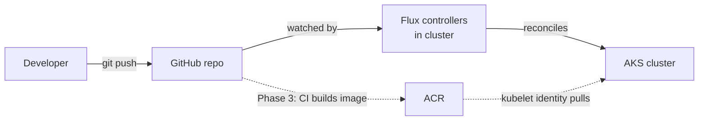
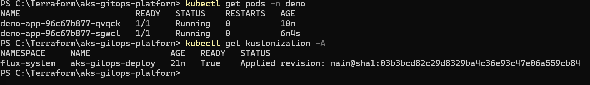
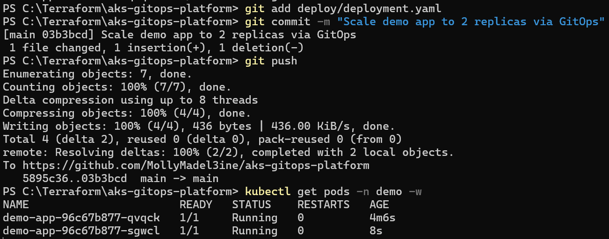
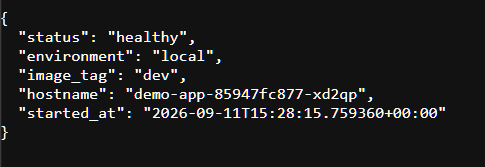
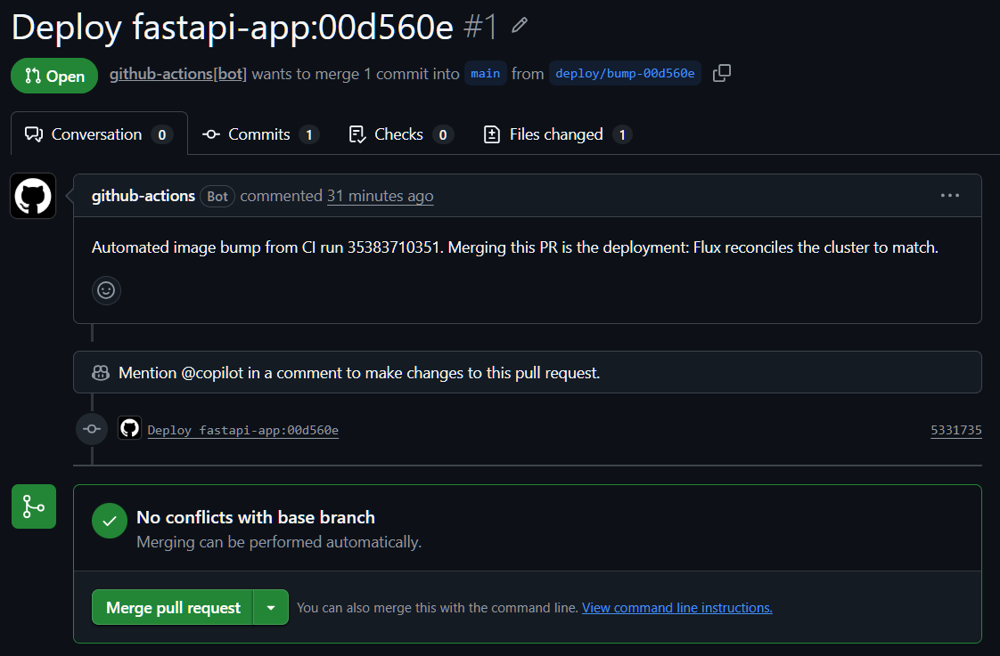
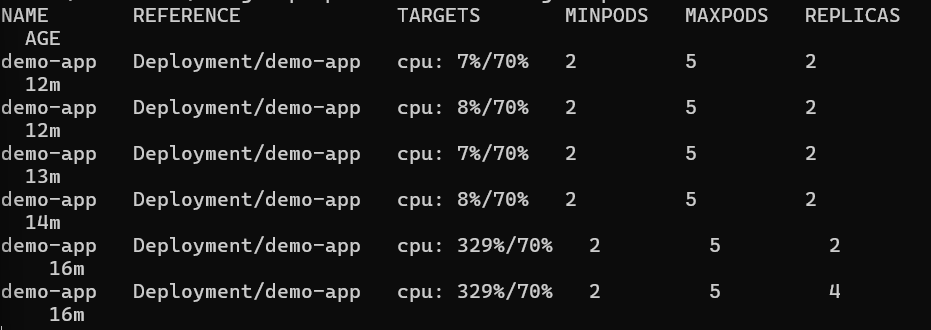
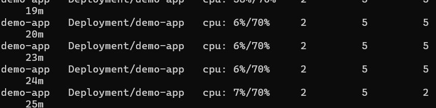

# AKS GitOps Platform — Pull-Based Kubernetes Delivery on Azure

A Terraform-provisioned AKS cluster where application deployments happen via GitOps: 
nothing uses "kubectl apply" applied manually. A controller in the cluster "Flux" watches 
this repo and reconciles the cluster to match it - pull based delivery, in contrast to the
push-based pipelines in my other repos.

**Portfolio context:** part of a four-repo series —
[azure-webapp-iac](https://github.com/MollyMadel3ine/azure-webapp-iac) ·
[container-iac](<!-- full URL -->) ·
[azure-sql-cost-analytics](<!-- full URL -->)

## Roadmap

- [x] Phase 1 — Cluster via Terraform (AKS, remote state, AcrPull via managed identity)
- [x] Phase 2 — GitOps controller (Flux via AKS extension, reconciliation loop proven)
- [x] Phase 3 — Full loop with the real app 
- [x] Phase 4 — Kubernetes-native operations

## Architecture

The previous repos in thsi portfolio deploy the way most pipelines do: push-based - 
a pipeline authenticates to Azure and shoves changes at the environment. This repo
inverts that. The pipeline never touches the cluster. Instead, a controller (Flux)
runs *inside* the cluster, watches this repository, and continuously reconsiles the
cluster to match whatever `deploy/` says. The commit is the deployment.

Pull-based delivery allows for 2 things that push-based can't. **Auditability** the cluster can
always name the exact commit it's running('kubectl get kustomization -A' shows the applied
revision), so asking 'what is deployed' has a Git answer. **Drift Recovery** anything that changes
the cluster outside of Git - a manual edit, a deleted object, a full `terraform destroy` - gets
reconciled back to the repo's desired state automatically. Rebuilding the cluster from nothing
redeploys the entire workload with zero deploy steps, since Git holds the desired state.

The repo is split along these boundaries: `infra/` is Terraform and own everything Azure - 
the cluster, the Flux extension, and the pointer telling Flux which repo and path to watch.
`deploy/` holds Kubernetes manifests and owns everything running *on* the cluster. Terraform
install the watcher; Git feeds it.


<!-- Adjust/expand once CI exists — the dotted lines become solid. -->

## The Loop, End to End

A code push to `app/**` reaches the cluster with no human touching kubectl: CI builds the image, pushes it to ACR with the git SHA as the tag, and opens a pull request bumping the image tag in `deploy/`. The merge is the deployment - Flux sees the new manifest on main and reconciles the cluster to match. Zero stored credentials anywhere in the chain: the build authenticates to Azure via OIDC federation, and the PR is opened with the workflow's built-in `GITHUB_TOKEN`.



*Two pods running and the kustomization that put them there: `READY: True`, applied revision pinned to the exact commit SHA*



*Scaling the pods from 1 to 2 replicas via a git commit - no kubectl, no pipeline, no portal*



*FastAPI health endpoint — image from shared ACR via kubelet identity, deployed by commit only*



*The workflow-opened pull request changes exactly one line - the image tag, old SHA to new - so every deployment lands as a reviewed diff.*


## Phase 4: Production Readiness

Phase 4 adds the four things Kubernetes workload needs before it can be called production-shaped: observability, resource management, health checking and autoscaling.Monitoring shows real usage, real usage sets the requests, the requests are what the autoscaler measures against, and the probes keep traffic away from pods that aren't ready during a scale-out.

All infrastructure chanfges went through Terraform, and all workload changes went through Git and Flux. Nothing was configured in the portal or applied with `kubectl apply`

### Container Insights

`infra/monitoring.tf` defines three resources:

  1. **A Log Analytics workspace** that stores collected data, with 30-day retention. It lives in the cluster's resource group, so `terraform destroy` removes it with everything else.
  2. **A data collection rule (DCR)** that defines what gets collected: the default Container Insights group (node and pod metrics, container logs, Kubernetes events) every minute, from all namespaces, in the ContainerLogV2.
  3. **A DCR association** that links the rule to the cluster.

The `oms_agent` block on the cluster enables th monitoring agent with `msi_auth_for_monitoring_enabled = true`, so the agent authenticates with managed identity instead of workspace keys. That continues the repo's no-stored-credentials design, and it's the mode that requires the DCR.

**Capacity cost:** the two monitoring agent pods (`ama_logs` DaemonSet and ReplicaSet) use about 22m CPU and 350Mi memory together. On a single D2s_v3 node, that's real headroom taken form the workload, and it's one of the inputs to the HPA's replica ceiling below.

### Resource requests and limits

Values were set from measured usage. At idle, each app pod used
about 2–4m CPU and 48Mi memory (`kubectl top pods`).

    resources:
      requests:
        cpu: 50m
        memory: 64Mi
      limits:
        memory: 128Mi

1. **Requests** reserve capacity for scheduling. The 50m CPU request leaves
   room above idle usage and gives the HPA a meaningful baseline to measure
   against.
2. **The memory limit** is set at twice the request. A container that
   exceeds it is killed and restarted (`OOMKilled`), which protects the
   other pods on the node from a memory leak.
3. **There is deliberately no CPU limit.** A container over a CPU limit
   isn't killed, it's throttled, and throttling shows up as slow responses
   that are hard to diagnose. Without a limit, the pod can use idle CPU on
   the node, while the request still guarantees its share under contention.

### Readiness and liveness probes

Both probes call the app's existing `/health` endpoint on port 8000.

| Probe     | Initial delay | Period | Failure action                          |
|-----------|---------------|--------|-----------------------------------------|
| Readiness | 5s            | 5s     | Pod removed from Service endpoints      |
| Liveness  | 15s           | 10s    | Container restarted                     |

1. **Readiness** answers "can this pod take traffic?" During a rolling
   update or an HPA scale-out, a new pod receives no traffic until it
   passes. Without it, Kubernetes sends requests as soon as the container
   starts, before the app inside has finished starting.
2. **Liveness** answers "is this pod broken?" It starts later than readiness
   so a slow startup isn't mistaken for a hung process.
3. **Liveness checks only the app itself.** If it checked a dependency like a
   database, a database outage would make Kubernetes restart every pod
   repeatedly, which wouldn't fix the database and would slow recovery.

### Horizontal Pod Autoscaler

`deploy/hpa.yaml` scales the Deployment on CPU utilization:

1. **Target: 70% of the 50m request**, so scale-out begins when average CPU
   passes 35m per pod.
2. **Minimum: 2 replicas**, the same floor the Deployment's fixed
   `replicas: 2` used to set. That line was removed in the same pull request.
   If both the Deployment and the HPA set the replica count, Flux resets it
   on every reconcile and fights the autoscaler.
3. **Maximum: 5 replicas**, bounded by the single node's capacity after
   system and monitoring pods.

**Load test:** a `busybox` pod inside the cluster called `/health` in a tight
loop, keeping traffic on the cluster network with no public endpoint needed.



*Under load, CPU rose to 329% of target and the HPA scaled from 2 to
5 replicas.*



*After the load stopped, the HPA waited through its default 5-minute
stabilization window, then returned to 2 replicas. The window prevents a
brief traffic dip from removing pods that are about to be needed again.*

**A safety property worth noting:** the first HPA manifest had a one-character
typo in its `apiVersion`. Flux's server-side dry-run rejected it, and because
Flux applies the `deploy/` folder as a unit, it applied nothing from that
commit. The running workload was unaffected until the corrected manifest
merged. A bad commit stopped at the door instead of reaching the cluster.

### What production would add

1. **Cluster autoscaler.** The HPA adds pods, but on a single node it hits
   a capacity ceiling. The cluster autoscaler adds nodes when pods can't be
   scheduled, and the two together give real elasticity.
2. **Alerting on Container Insights data**, such as restart counts or
   sustained high memory, routed to an action group.
3. **A dedicated user node pool**, so application pods don't share the
   system node pool with cluster components.

## Design Decisions


### Flux over Argo CD
Lighter footprints and first-party Azure integration (AKS GitOps extension)

### Azure CNI Overlay over kubenet
The cluster's `network_profile` had 3 realistic options in 2026: kubenet, traditional
Azure CNI(every pod gets a real VNet IP) and Azure CNI overlay. Kubenet is on a deprication
path and the traditional CNI would force subnet sizing to max pods + max nodes up front, which
makes it outsized for this demo.

CNI Overlay is the current recommended default and takes the middle path: nodes
get VNet IPs, pods get addresses from a private overlay range (10.244.0.0/16 
by default) that never touches the VNet address space. Modern CNI behavior,
no subnet sizing concerns, and it's the networking model that Microsoft is steering
AKS towards. The visible evidence on the cluster: the `azure-cns` pods in `kube-system`.

### Cluster-scoped Flux configuration
The azurerm provider defaults a Flux configuration to `namespace` scope - the
applier service account can only manage objects within a single namespace. That
default is the least-privilege choice and it surfaced immediately: the first 
reconciliation failed with an RBAC Forbidden, because `deploy/` starts by creating the `demo`
namespace itself, and a namespace-scoped applier can't create namespaces - they're cluster
level objects.

This config runs scope = "cluster" deliberately: the repo owns the whole cluster's
desired state, namespaces included. That's the right posture for a single-tenant cluster
where Git is authoritative for everything. In a shared, multi-team cluster the default would
win instead - one namespace scoped Flux config per team. Scope here is a permission boundary,
not an address: the config still *lives* in `flux-system` either way; scope governs what it
can manage.

### Public nginx first, real app second
Phase 2 proved the reconciliation loop with `nginx:1.27` from Docker Hub, not this portfolio's
FastAPI app from ACR - deliberately. The first Flux sync had one job: prove the loop mechanics.
Wiring the real app from the start would have put two unproven systems in the same failure 
surface - Flux recon *and* ACR image-pull auth via the kubelet identity. A failed first sync would 
then have two suspects and no way to tell them apart. A public image needs no auth at all, so any 
Phase 2 failure could only be the loop itself.

It worked as designed: Phase 2's failures (RBAC scope, a YAML syntax error) were all loop mechanics,
debugged w/o ever wondering whether the registry was the problem. The swap to the real image became 
Phase 3's opening move- a one-commit change that doubled as the first live test of the AcrPull wiring.
When the FastAPI pods reached `Running`, that isolated one claim: the managed-identity img pull works.


### Node SKU by quota, not preference
The plan was to use 'Standard_B2s' - the cheapest sensible burstable SKU at ~$30/month when left running.
The subscription prevented this in 2 different instances:

1. **`Standard_B2s`** - rejected outright: westus2 restricts this SKU for this subscription(`SkuNotAvaiable`). Not
a quota problem, the size simply isn't offered to this subscription in this region.
2. **Bsv2 family** `B2s_v2` - avaialble in this region, but the subscription's quota grant for the whole family
is zero vCPUs. It appears available but can't be used.
3. **`Standard_D2_v2`** - quota available; this is what phase one shipped on. However, Dv2 is the oldest
general-purpose generation and carries a legacy price premium. (~ $85-100/month)
4. **`Standard_D2s_v3`** - the Phase 2 pre-flight swap once `az vm list-usage` confirmed Dsv3 quota:
newer generation, 8 GB RAM instad of 7, and *cheaper* per hour (~153/month vs ~$183/month for D2_v2, westus,
PAYG Linux, Sept 2026) than the older SKU it replaced. The swap also turned out to be ahead of a deadline:
Dv2 is slated for retirement, so the working Phase 1 SKU had a shelf life regardless. 

The monthly figures above are worst-case framing. Under this repo's destroy-between-sessions doctrine
the node exists for hours, not months -  a two hour build-verify-destroy session costs roughly $0.20.
The SKU choice matters for correctness and rebuild determinism far more than for cost.

The operational lesson: on a real subscription, instance selection is not "pick a size from the docs."
It's the intersection of four independent gates - regional SKU availability, per-family quota grants, 
price by generation and lifecycle (Dv2's pending retirement would have forced this migration eventually;
the quota gaunlet just forced it early). Only `az vm list-usage --location <region>` , plus a check of the
retirement announcements tells you what you can actually deploy. The Terraform comment on `vm_size` documents 
the full path so a rebuild in a different subscription knows why the value is what it is.

### ClusterIP, not LoadBalancer
The demo's app service is `type: ClusterIP` - reachable only from inside the cluster. The tempting default
for "Let me see my app" is ` type: LoadBalancer`, which provisions an Azure public IP and exposes the workload
to the internet in one line of YAML.

This repo doesn't need that line, so it doesn't have it.

1. **Nothing here serves external users.** The audience for this app is the person verifying the GitOps loop
works. `kubectl port-forward` provides exactly that - an authenticated, on-demand, private tunnel that exists
only when the terminal session does. Verification traffic doesn't justify a standing public endpoint.
2. **A LoadBalancer is attack surface plus cost** A public Ip can be scanned on the internet within miniutes of
existing, and Azure bills for it. An exposure that serves no requirement is pure liability.
3. **It kept the port bug catchable.** The `targetport` typo was diagnosed by reading the port-forward's 
resolution line - the tooling for private access doubles as diagnostic tooling.

This is the same posture as the landing zone repo, one layer down the stack: there, the database was 
reachable only through a private endpoint - never internet-facing; here, the workload is reachable 
only through the cluster's internal network. Different Azure primitivesd, same rule: **private by
delfault; every public endpoint must earn it's existence with a requirement. ** Ingress with TLS
is the documented extension path if this app ever gains real users - a deliberate future decision, 
not a default accepted silently.

### No kube_config in outputs
The `azure_kubernetes_cluster` resource exposes a `kube_config_raw` attribute - full cluster admin credentials
 - and it's common to see it wired into an output for convenience. This repo doesn't do that: outputs are cluster
*name* and resource-group only, and credentials are fetched on-demand with `az aks get-credentials`, which
authenticates through the caller's own Azure AD identity. Anything in an output lands in the state file in 
plaintext, and even marked `sensitive` , that's a standing admin credential sitting in a storage account - 
when a one-line, identity based alternative exists, the secret shouldn't be stored at all.

### CI design: Actions, variables and SHA tags
Three decsisions but one theme - the delivery chain should contain nothing worth stealing and nothing that can drift.

**GitHub Actions over Az DevOps** The rest of this portfolio demonstrates utilizing Az DevOps: webapp-iac runs a 
multi-stage YAML pipeline with approval gates, and container-app-iac deepens it. GitHub Actions was the gap and
it's also native to the repository, so the CI joins the loop instead of reaching into it from outside. The main
deciding factor was authentication: Action's first-class OIDC federation with Entra means the pipeline holds no
credential at all. Az DevOps remains a defensible alternative - the org and service principal already exist 
from prior repos - but it would have necessitated a stored secret or service connection where this design 
needed neither. 

**Repository variables, not secrets** The workflow authenticates with three values: client ID, tenant ID, 
subscription ID. All three live in GitHub as plain `vars` not `secrets` - deliberately. They are identitfiers,
not keys: knowing them gets an attacker nothing without the ability to mint a token that GitHub will only issue
to this repo on `main`, and that Entra will only exchange against the pinned, federated subject. Storing them as 
secrets implies they need protecting, and implying that would misstate the security model. The delivery chain
contains zero secrets; the variables tab is the proof.

**Commit-SHA tags, never `latest`** Every image is tagged with the full 40-character SHA of the commit that 
built it, and no tag is reused or overwritten. This is not a style preference - it's what makes the repo's
central claim literally true. GitOps promises that Git describes exactly what runs; a mutable tag like `latest`
can break that promise - with the manifest saying one thing while the registery quietly serves another. Immutable
tags also make the coming tag-bump flow meaningful: a deployment change is a visible diff in `deploy/`, reviewed 
like any other code, traceable from a running pod back to the exact commit that produced it.

The generalizable lesson: authentication you don't store can't leak, values that aren't secret shouldn't pretend 
to be and imutable tags are what let Git tell the truth.

### identity/federated-credential.json
Created imperatively via `az ad app federated-credential create` kept as the record of the trust boundary; not
applied by any automation.

### PR-based image-bumps - the merge is the deployment

Phase 3's final step had two ways to land the new image tag in `deploy/`: the CI workflow commits directly to main, or it opens a pull request that a human merges. This repo uses the PR.

Direct commit is simpler: fewer steps, fully unattended, and a legitimate pattern - it's how many GitOps shops run their dev environments. But this cluster is the repo's only environment, so it gets the production treatment: every deploy is a reviewed, one-line diff. Merging that diff is the deployment action - no kubectl, no pipeline apply step, no pipeline credentials that could deploy outside the review path.

The PR is opened with the wrokflow's built-in `GITHUB_TOKEN` and the `gh` CLI - not 3rd party action, no new secrets, continuing the chain that started with OIDC federation: nothing in this pipeline holds a stored credential.

The bump job lives in the same workflow as the build (`needs: build`), so one file reads top to bottom for the delivery story. A paths filter (`app/**`) keeps merged bumps from retriggering the build - CI owns `app/`, flux owns `deploy/`, and the trigger encodes that boundary.

This closes a thread that runs through the porfolio: infrastructure changes gate behind approval (azure-webapp-iac), and now deployments gate behind review here. Nothing reaches Azure - resources or workloads- without a human approving a diff.

### Resource Requests from observed usage, no CPU limit

Requests were set from measured idle usage rather than guessed. With the cluster rebuilt, `kubectl top pods` showed each replica at 2m CPU and 47Mi memory, so the container requests 50m CPU and 64Mi memory, leaving headroom for real traffic.

The CPU request is also sized for the HPA. Utilization is calculated as a percentage of the request, so a modest request means a load test can meaningfully cross the scaling target; an oversized request would leave the HPA with nothing to react to.

Memory has a 128Mi limit, roughly 2.7 times idle usage, as a cap against leaks: exceeding it get the container OOMKilled and restarted, a visible failure rather than a slow one. CPU is deliberately left unlimited. CPU limits throttle rather than kill, which tends to surface as latency that's hard to diagnose; the request already guarentees the pod its share of the node.

### Readiness and liveness probes on /health

Readiness gates traffic: a pod is added to the Service's endpoints only after /health responds, so rolling updates never route requests to a pod that is still starting. It checks early and often (after 5s, every 5s) so new pods join quickly.

Liveness restarts a hung process. It waits longer before it's first check (15s) and needs three consecutive failures (~45s) befor restarting, so a slow start or a single slow response doesn't cause a restart. It checks only the app itself; tying liveness to an external dependency would restart healthy pods during an outage they can't fix. 


## Troubleshooting Log

Every failure this project hit, what it looked like, and - the useful part - *how it was caught*. The
diagnostic route matters more than the fix: the same error class will recur, and the route is what
transfers.

| #   | Symptom                                             | Root cause                                                        | How it was caught                                          |
| --- | --------------------------------------------------- | ----------------------------------------------------------------- | ---------------------------------------------------------- |
| 1   | `undeclared resource` on plan                       | `azure_` vs `azurerm_` typo                                       | Error text quotes the misspelling verbatim                 |
| 2   | <!-- SKU error -->                                  | B2s restricted in westus2                                         | `az vm list-skus` restrictions column                      |
| 3   | <!-- quota error -->                                | Zero Bsv2-family vCPU quota                                       | `az vm list-usage`                                         |
| 4   | 409 on Flux extension                               | `Microsoft.KubernetesConfiguration` provider unregistered         | Error names the namespace; one-time `az provider register` |
| 5   | Kustomization `READY: False`, Forbidden             | Flux config defaulted to namespace scope; can't manage namespaces | `kubectl get kustomization -A` status text                 |
| 6   | Deployment dry-run failed, `expected list, got map` | `-containerPort` — missing space after YAML dash                  | Error quotes the fused key                                 |
| 7   | Connection refused through Service; pods Running    | `targetport` lowercase — silently defaulted to port 80            | Port-forward's `-> 80` resolution line                     |
| 8   | `terraform destroy`: "no objects"                   | Ran from repo root, not `infra/`                                  | Message contradicted known reality; `pwd` check            |

### Subscription gates: a field guide
Three different ways a subscription says "no," hit in sequence during Phase 1–2.
None are code bugs; all are invisible until first contact with a real subscription.

| #   | Error                                                                         | What it actually means                                                                                       | Fix                                                                                                   |
| --- | ----------------------------------------------------------------------------- | ------------------------------------------------------------------------------------------------------------ | ----------------------------------------------------------------------------------------------------- |
| 1   | `SkuNotAvailable` for `Standard_B2s`                                          | Regional SKU restriction — the size isn't offered to this subscription in westus2 at all                     | Pick a different SKU (see decision log: SKU by quota)                                                 |
| 2   | Quota check: Bsv2 family limit = 0 vCPUs                                      | SKU is offered, but the subscription's quota grant for the family is zero                                    | `az vm list-usage --location westus2` before choosing; land on a family with quota                    |
| 3   | `409 MissingSubscriptionRegistration` for `Microsoft.KubernetesConfiguration` | The GitOps extension's resource provider was never registered — the API namespace is dormant until first use | `az provider register --namespace Microsoft.KubernetesConfiguration`, wait for `Registered`, re-apply |

Terraform silently auto-registers the *common* providers, which is why four
prior repos never surfaced #3. Fresh-subscription prerequisite: the register
command above is in the rebuild ritual.

### One-character bugs, three different detection routes

| Bug                                                | Failure mode                                                                                                | How it was caught                                                                      |
| -------------------------------------------------- | ----------------------------------------------------------------------------------------------------------- | -------------------------------------------------------------------------------------- |
| Typo in the Flux Terraform resources               | Loud — plan/apply error names the line                                                                      | Read the error; it points at itself                                                    |
| `-containerPort` (stray hyphen in deployment.yaml) | Rejected manifest — Flux won't apply it                                                                     | `kubectl get kustomizations -n flux-system` status message quoted the schema violation |
| `targetport` (lowercase, should be `targetPort`)   | **Silent** — legal YAML, unknown field ignored, Service defaults targetPort to port; pods run, traffic dies | Behavioral: `kubectl port-forward` output's resolution line showed the port mismatch   |

The progression is the lesson: error text → controller status → observed
behavior. The first two failure classes announce themselves with decreasing
volume; the third says nothing and has to be *noticed*. Kubernetes' schema
tolerance means a typo can demote a field to a no-op — `kubectl explain` or
paying attention to what the tooling resolves is the countermeasure.

### Operational reflexes (learned the hard way)

| Symptom                                                      | Root cause                                                                                                                       | Reflex earned                                                                                                                                                                                                       |
| ------------------------------------------------------------ | -------------------------------------------------------------------------------------------------------------------------------- | ------------------------------------------------------------------------------------------------------------------------------------------------------------------------------------------------------------------- |
| `dial tcp: lookup ...azmk8s.io: no such host` from kubectl   | Stale kubeconfig — pointing at a destroyed cluster's dead hostname                                                               | Rebuild ritual is always the pair: `terraform apply` → `az aks get-credentials --overwrite-existing`. Hostname in the error not matching a live cluster = staleness, ~95% of the time in a destroy/rebuild workflow |
| Terraform behaving against the wrong state                   | Running from the repo root instead of `infra/`                                                                                   | Check the prompt's directory before any terraform command; `terraform plan` (free, safe) any time the session loses track of reality                                                                                |
| `No resources found in demo namespace` after first Flux sync | Flux configuration scoped to `namespace` (provider default) — the applier lacked RBAC to create namespace-level objects from Git | `scope = "cluster"` on the flux configuration; surfaced as an RBAC Forbidden in the kustomization status                                                                                                            |

### detection route: 
AADSTS error code carrying the presented assertion; root cause: GitHub's subject claim format embeds immutable IDs, defeating name-based trust records; fix: pin the federated credential to the ID-enriched subject.

### `flux: command not found` - controller in-clsuter don't equal CLI on the workstation

**Symptom:** Attempting `flux reconcile kustomization` during the loop demo failed with command-not-found, despite Flux demonstrably running - the cluster had been reconciling from Git for two phases.

**Cause:** Flux was installed via the AKS GitOps extension (`Microsoft.KubernentesConfiguration`), which deploys the Flux *controllers* into the cluster but installs nothing on the local machine. The `flux` CLI is a separate, client-side tool - the same relationship as kubectl to the API server. Two phases of successful reconciliation never surfaced this because the loop is pull-based: the controllers act on Git alone and no local command is ever required.

**Resolution:** No install needed - both operations have no-CLI equivalents already on the workstation:
- Force a reconcile: `az k8s-configuration flux kustomization update` (or simply wait out the sync interval - the controllers poll on their own)
- Inspect sync state: `kubectl get kustomizations -A` and `kubectl get gitrepositories -A`, since Flux exposes it's state as ordinary Kubernetes cutsom resources.
  
**Takeaway:** The extension path trades the vendor CLI for Azure-native tooling. That's consistent with this repo's design - Flux managed through Terraform and `az`, not hand-installed - so the missing CLI is a feature of the choice, not a gap. The `flux` CLI remains worth installing on a real workstation for it's richer diagnositcs (`flux logs`, `flux tree`).

### `InvalidImageName` after rebuild — a variable that never existed

**Symptom:** After rebuilding the cluster from zero, the app pods sat in
`InvalidImageName`. The manifest's image line on main read
`.azurecr.io/fastapi-app:<sha>` — registry name missing, leading dot,
unparseable.

**Cause:** The bump job's sed built the image reference from
`${{ vars.ACR_NAME }}` — a repository variable that was never defined.
The build job had always used the correctly-named `ACR_LOGIN_SERVER`;
the bump job was written against a variable that didn't exist. GitHub
Actions does not error on a reference to an undefined variable — it
expands to empty string — so the sed wrote the broken line and the job
went green. Every bump the job ever produced was invalid, from its
first run.

**Why it stayed hidden — twice over:** Kubernetes rolling updates keep
the old ReplicaSet serving when the new one cannot start, so the
cluster stayed healthy-looking after every broken bump. And the
service's label selector still matched the old pods, so a
post-"deployment" health check succeeded — answered by the previous
workload. A green pipeline, running pods, and a 200 from `/health` all
coexisted with a manifest that could never deploy. Only a rebuild from
zero — no prior ReplicaSet to hide behind — forced the defect into
the open.

**Resolution:** Unified both jobs on the one variable that exists
(`ACR_LOGIN_SERVER`, the full login server; the sed no longer appends
`.azurecr.io`), and added a guard step that fails the job loudly if
the variable is empty. Verified end to end: version bump → build →
PR with a valid image line → merge → Flux convergence → `/health`
returning the new version.

**Takeaway:** Actions expands undefined `vars.*` references silently —
any job that interpolates a variable into a file needs a guard.
And "the pipeline is green and the app responds" is not "the
deployment worked": rolling updates and service selectors can conspire
to make a failed rollout look like a successful one. Rebuild-from-zero
is the audit that can't be fooled.

### DCR `InvalidPayload` on rebuild, cleared on retry with unchanged code: 

**Symptom:** A from-zero `terraform apply` failed at creating the Container Insights data collection rule:
`InvalidPayload: Data collection rule is invalid` (HTTP 400). The same `monitoring.tf` had applied cleanly the day before. Every other reource, including the cluster and the Log Analytics workspace, created successfully.

**Cause (most likely, unproven):** The workspace and the DCR were created in the same run, seconds apart. Terraform waits for ARM to report the workspace as created, but the Az Monitor service that validates the DCR's destination can lag behind that report. A contributing factor: the workspace had been destroyed the previous evening, and Log Analytics keeps deleted workspaces in a soft-delete state for 14 days. Recreating a wrokspace with the same name in the same resource group recovers the soft-deleted one rather than creating a new one, which can take longer to become fully usable. The first-apply of this code involved neither situation, which is why it succeeded.

**Fix:** None needed in code. A failed apply does not roll back; Terraform keeps what succeeded and records it in state. `terraform state list` showed 6 of 8 resources present, and a second `terraform apply` planned only the two missing ones (the DCR and its association). Both created in about two seconds each.

**Lesson:** When a resource fails on a rebuild with code that previously applied cleanly, suspect the environment before the config. Confirm the code is unchanged(`git status`, `git log -- <file>`), check what state already holds, and retry once. If the retry failes the same way, check the dependency's provisioning state directly (`az monitor log-analytics workspace show --query provisioningState`) rather than retrying again. 

### Spurious in-place update: AKS node pool `upgrade_settings`

**Symptom:** After the partial apply above, the retry plan show `2 to add, 1 to change`. The change was an in-place update to `azurerm_kubernetes_cluster.main`, removing an `upgrade settings` block from the `default_node_pool`: 
`max_surge = "10%" -> null`, `drain_timeout_in_minutes = 0 -> null`, `node_soak_duration_in_minutes = 0 -> null`

**Cause:** The Terraform code never declared `upgrade_settings`. When AKS created the node pool, Azure applied its own defaults for those settings. Terraform then saw values in Azure that were absent from the code and planned to remove them. Nothing about the cluster had actually changed. Left alone, this becomes a perpetual diff: Terraform nulls the settings, Azure restores its defaults, and every future plan shows the same change.

**Fix:** Declared Azure's defaults explicitly in `default_node_pool`:
  
    upgrade_settings {
      max_surge                     = "10%"
      drain_timeout_in_minutes      = 0
      node_soak_duration_in_minutes = 0
    }

The next plan showed `2 to add, 0 to change`, and a post apply plan reported no changes.

**Lesson:** An unexpected in-place change on a freshly created resource is usually provider default drift, not real drift. It's still worth reading before approving: the diff shows exactly which values Azure filled in, and declaring them makes the code describe what is actually running. This pattern recurs across many Az resources wherever the API sets defaults the Terraform config doesn't mention.

## Rebuild Ritual

Destroying the environment costs nothing to undo: two commands and ~10 minutes stand between an empty subscription
and the full working stack, app included.

```powershell
cd infra
terraform apply                         
az aks get-credentials `
  --resource-group $(terraform output -raw resource_group_name) `
  --name $(terraform output -raw cluster_name) `
  --overwrite-existing
kubectl get pods -n demo -w            
```

No redeploy step exists because the cluster was never the source of truth - Git held the desired state the whole time, 
and a fresh cluster reconciles to it.

**Fresh-subscription prerequisite:** `az provider register --namespace Microsoft.KubernetesConfiguration` (one-time; the Flux extension 409s without it).

## Cost Notes

The control plane is free, node ~$153/mo if left running, destroy-between-sessions makes a 2-hour session ~$0.42.
A forgotten cluster left running overnight = ~$2.51 
State storage + shared ACR (Basic) persist at ~$5-6/mo total. -->

Container Insights adds two agent pods(`ama-logs` DaemonSet and ReplicaSet), using about 22m CPU
and 350Mi memory combined on the single node, plus Log Analytics ingestion charges, which stay small under the destroy-between-sessions workflow.

## Repo Structure

```
aks-gitops-platform/
├── infra/          # Terraform — the cluster and everything Azure
├── deploy/         # Kubernetes manifests — what Flux keeps true
└── docs/images/    # proof
```
That's the repo's whole architecture: Terraform installs the watcher; Git feeds it. 
